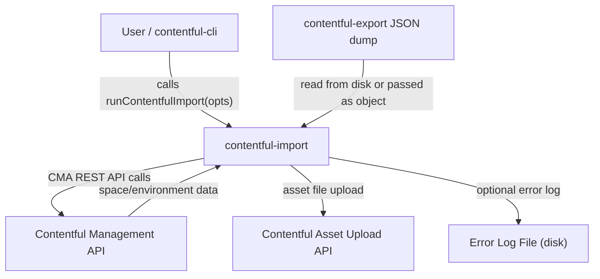
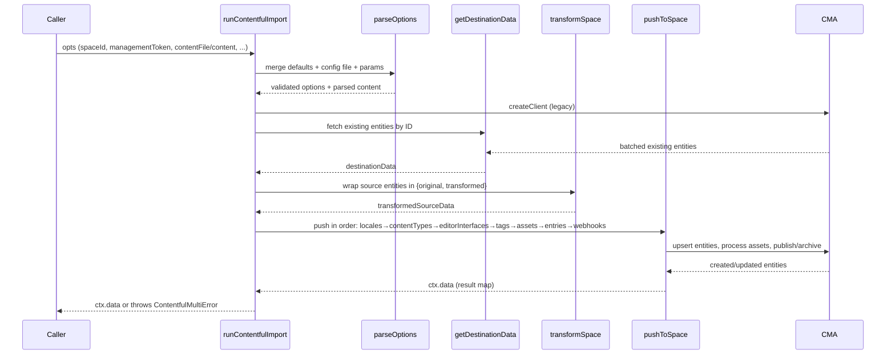

# Architecture

<!-- Generated by seed-golden-context | Last updated: 2026-05-05 -->

## Overview

`contentful-import` is a Node.js library and CLI tool that imports JSON content dumps (produced by [`contentful-export`](https://github.com/contentful/contentful-export)) into a Contentful space. It handles the full import lifecycle: validating input, fetching existing destination content, transforming source data, creating/updating entities in the correct dependency order, and publishing/archiving them to match the source state.

The official CLI interface is hosted in [`contentful-cli`](https://github.com/contentful/contentful-cli). This package exposes the library API used by that CLI and is also importable directly as a Node.js module.

## System Context

## Internal Structure

| Directory/File | Purpose |
|---|---|
| `lib/index.ts` | Main entry point. Orchestrates the full Listr task pipeline: parse options → validate → init client → fetch destination → transform → push. Exports both CJS and ESM. |
| `lib/parseOptions.ts` | Merges default options, config file, and params. Parses chunked JSON for large content files (`@discoveryjs/json-ext`). Validates required fields. |
| `lib/tasks/init-client.ts` | Creates a CMA.js `legacy` client from the parsed options. |
| `lib/tasks/get-destination-data.ts` | Fetches existing entities from the destination space to enable upsert logic. Uses batched ID queries (≤100 IDs, ≤1990 chars per batch) and paginated queries where ID-scoping isn't applicable (locales, tags). |
| `lib/tasks/push-to-space/` | Sub-tasks that push content in dependency order: locales → content types → editor interfaces → tags → assets (upload + process + publish) → entries (publish/archive) → webhooks. |
| `lib/tasks/push-to-space/creation.ts` | Entity create/update logic. Upserts: creates if not in destination, updates if already exists. Respects `skipUpdates` flags. |
| `lib/tasks/push-to-space/publishing.ts` | Publish and archive logic. Matches source publish/archive state. |
| `lib/tasks/push-to-space/assets.ts` | Asset processing: streams local files for upload, processes asset jobs with retry logic. |
| `lib/transform/transform-space.ts` | Runs all entity-type transformers over source data. Wraps each entity in `{ original, transformed }` for change detection. Sorts entries and locales before transformation. |
| `lib/transform/transformers.ts` | Per-entity-type transformer functions. Assets get a new `upload` URL derived from the existing URL. Locales drop IDs so the API chooses the right create path. Webhooks strip credentials and secret headers. |
| `lib/utils/` | Joi validation schema (`schema.ts`), error helpers (`errors.ts`), header builder (`headers.ts`), entry/locale sort utilities. |
| `lib/types.ts` | Shared TypeScript types for source, destination, and transformed data shapes. |
| `lib/usageParams.ts` | Parses CLI arguments via yargs. Used by `bin/contentful-import`. |
| `bin/contentful-import` | CLI binary. Prints deprecation notice (CLI moved to `contentful-cli`), then delegates to `runContentfulImport`. |
| `test/unit/` | Jest unit tests, mirroring `lib/` structure. |
| `test/integration/` | Integration tests that create/destroy real Contentful spaces. Requires `MANAGEMENT_TOKEN` and `ORG_ID` env vars. |

## Data Flow

**Key design choices in the flow:**
- Entities are fetched from the destination by their source IDs only (not a full dump), keeping import scope narrow.
- Tags are fetched with pagination (no ID scoping) because they must all be present for tag-stripping logic in transformers.
- If the destination space doesn't support tags (404), `destinationData.tags` is deleted, and the `removeMetadataTags` transformer strips metadata from entries/assets.
- Webhooks are only imported to the `master` environment.
- Rate limiting is enforced via `p-queue` (default 7 req/s) across all CMA calls.

## Domain Concepts

| Concept | Notes |
|---|---|
| **Space** | Top-level Contentful container. Import always targets a specific space + environment. |
| **Environment** | A branch of a space's content. Defaults to `master`. Webhooks can only be imported to `master`. |
| **Content Type** | Schema definition. Must exist before entries referencing it can be created. Imported and published before entries. |
| **Editor Interface** | Per-content-type UI configuration. Imported after content types are published. |
| **Locale** | Language/region variant. Locales lose their IDs during transformation so the API can assign a compatible create path. Default locale must match between source and destination or the import will fail validation. |
| **Tag** | Taxonomy label. Feature-gated — spaces without tag access silently skip tag import and strip metadata from entries/assets. |
| **Entry / Asset** | Content. Upserted based on sys.id. Publish/archive state mirrors the source. |
| **Upload** | Transient CMA resource for binary file upload. Created when `uploadAssets: true`; `uploadFrom` link replaces the `upload` URL on the asset before creation. |

## Key Dependencies

| Dependency | Why it's here |
|---|---|
| `contentful-management` | CMA.js client for all Contentful API operations. v12+ with `{ type: 'legacy' }` chain client. |
| `contentful-batch-libs` | Shared utilities: logging emitter, listr task wrapper, proxy helpers, sequence header injection. |
| `@discoveryjs/json-ext` | Streaming JSON parser (`parseChunked`) for large export files that would OOM with `JSON.parse`. |
| `p-queue` | Rate-limit all CMA requests to ≤7/s (configurable). Prevents 429 errors. |
| `listr` + renderers | Progress UI for the import pipeline. Verbose renderer available for CI. |
| `joi` | Validates the input content payload shape before any API calls are made. |
| `bluebird` | `Promise.props` for parallel destination data fetching. |
| `lodash` | Entity transformation utilities (omit, pick, find, reduce). |
| `tsup` | Dual CJS+ESM build from TypeScript source. Produces `dist/index.js` (CJS) and `dist/index.mjs` (ESM). |
| `semantic-release` | Automated versioning and npm publish on merge to `main` or `beta`. |

## Configuration

| Option | Purpose | Default |
|---|---|---|
| `spaceId` | Target Contentful space ID | required |
| `environmentId` | Target environment | `master` |
| `managementToken` | CMA token with write access to target space | required |
| `contentFile` | Path to export JSON file on disk | — |
| `content` | Export data as a JS object (alternative to `contentFile`) | — |
| `contentModelOnly` | Import only content types, locales, editor interfaces | `false` |
| `skipContentModel` | Skip content types and locales; import only entries/assets | `false` |
| `skipLocales` | Skip locale import | `false` |
| `skipContentPublishing` | Create entities but do not publish or archive | `false` |
| `skipContentUpdates` | Skip updating existing entries | `false` |
| `skipAssetUpdates` | Skip updating existing assets | `false` |
| `uploadAssets` | Upload local asset files (from `contentful-export --downloadAssets`) | `false` |
| `assetsDirectory` | Path to local asset files when `uploadAssets: true` | — |
| `rateLimit` | Max CMA requests per second | `7` |
| `host` | CMA host override | `api.contentful.com` |
| `proxy` | HTTP proxy in `[user:pass@]host:port` format | — |
| `rawProxy` | Pass proxy config directly to Axios instead of creating an httpsAgent | `false` |
| `headers` | Additional HTTP headers on every CMA request | — |
| `timeout` | Asset processing retry delay (ms) | `3000` |
| `retryLimit` | Max asset processing retry attempts | `10` |
| `errorLogFile` | Path for JSON error log on failure | auto-generated timestamp path |
| `useVerboseRenderer` | Log each step on a new line (CI-friendly) | `false` |
| `config` | Path to a JSON config file (merged with lower priority than direct params) | — |

**Integration test environment variables** (not used by the library itself):

| Variable | Purpose |
|---|---|
| `MANAGEMENT_TOKEN` | CMA token for integration test space lifecycle |
| `ORG_ID` | Organization ID for creating test spaces |

## Operational Knowledge

> **Note:** Some operational details have been generalized for this public repository.
> Internal team members: see [internal runbook] for full operational procedures.

### Deployment

This library is published to npm via `semantic-release` on merge to `main` (stable) or `beta` (prerelease). The release workflow:
1. CI runs: `build → check → test-integration` in parallel
2. On success and merge to `main`/`beta`, the `release` job runs `npm run semantic-release`
3. Version is derived from conventional commit types (`feat!` → major, `feat` → minor, `fix`/`build(deps)` → patch)
4. Changelog and GitHub release are created automatically

Rollback: publish a patch release that reverts the breaking change, or use `npm dist-tag` to point `latest` at a previous version.

### Failure Modes

| Failure | Likely Cause | Resolution |
|---|---|---|
| `The spaceId option is required` | Missing required param | Pass `spaceId` and `managementToken` |
| `Default locale mismatch` | Source and destination spaces have different default locales | Ensure spaces share the same default locale, or use `skipLocales` if locales aren't being imported |
| `ContentfulMultiError` | One or more entities failed during push | Check the error log file (path printed in output) for per-entity details |
| 429 rate limit errors | API rate limit exceeded | Lower `rateLimit` option below 7 |
| Asset processing timeout | Asset CDN processing is slow | Increase `timeout` and `retryLimit` options |
| Large file OOM | Export JSON too large for `JSON.parse` | Ensure `@discoveryjs/json-ext` is not being bypassed; file is read via `parseChunked` |
| Tags 404 | Space doesn't have tags feature | Expected behavior — tags are silently skipped |

### Monitoring

[NEEDS TEAM INPUT] — This is a library/CLI tool, not a running service. Monitor npm download health and GitHub issues for user-reported breakage.

### Incident Playbook

[NEEDS TEAM INPUT] — For publish failures, check the GitHub Actions `release` workflow and semantic-release output. For broken releases, use `npm dist-tag add contentful-import@<safe-version> latest` to repoint users to a known-good version.
